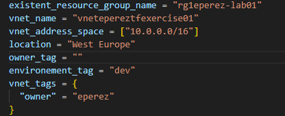

# Validación variables cadenas no vacías ni null

Se ha creado una variable local llamada ``listavariables`` donde se encuentran las tres variables owner_tag, environement_tag y vnet_name. 

También se ha creado una función en la cual se valida que ninguna de las variables esté vacía o sea null. Para ello se recorre la lista de variables y el resultado será true si alguna de ellas está vacía o es null; o false en caso contrario.

En el recurso se utiliza ``count`` para crear o no el recurso en caso de que el resultado de la función anterior true o false.

- Ejemplo 1: 

En este caso crea el recurso

- Ejemplo 2

En este caso no crea el recurso porque owner_tag está vacía

# Validación valores DEV, PRO, TES y PRE para la variable environement_tag

